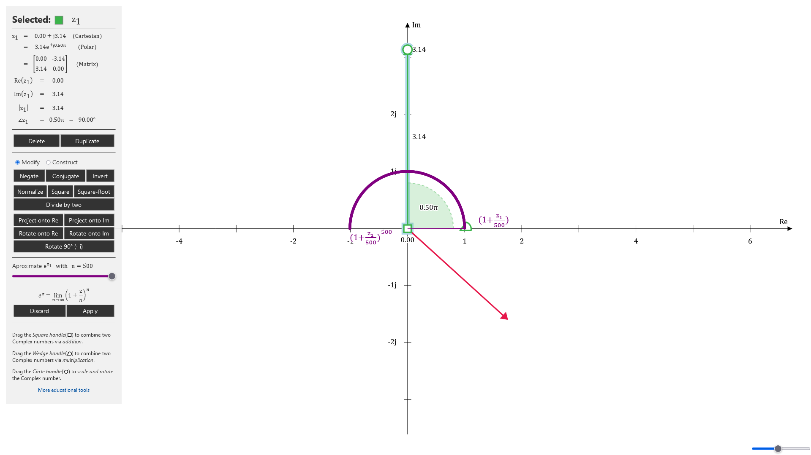

# Complex Plane

[Live Demo](https://static.laszlokorte.de/complex-plane/) | [Video](https://www.youtube.com/watch?v=ZS-Bci4DksQ)

Explore the geometry of complex numbers in the complex plane. See you complex number multiplication corresponds to two-dimensional scaling and rotation.

Also see how the definition of the natural exponentiation translates intuitively to the Complex Numbers.